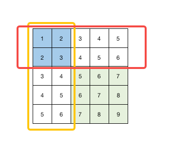

# 304. 二维区域和检索
[原题链接🔗](https://leetcode-cn.com/problems/range-sum-query-2d-immutable/)  

给定一个二维矩阵 `matrix` ，以下类型的多个请求：

计算其子矩形范围内元素的总和，该子矩阵的左上角为 `(row1, col1)` ，右下角为 `(row2, col2)` 。
实现 `NumMatrix` 类：

 - `NumMatrix(int[][] matrix)` 给定整数矩阵 `matrix` 进行初始化
 - `int sumRegion(int row1, int col1, int row2, int col2)` 返回 **左上角** `(row1, col1)` 、**右下角** `(row2, col2)` 所描述的子矩阵的元素 **总和** 。

## 解题思路
### 前缀法
在初始化该结构的时候直接进行一次遍历，得到每一位对应的区域元素和，即

$$ sum_{(i,j)} = nums_{(0,0)} + nums_{(0,1)} + ... + nums_{(1,0)} + ... + nums_{(i, j)} $$

再在在首行和首列插入一行零值，即

$$ sum_{(i,j)} = nums_{(0,0)} + nums_{(0,1)} + ... + nums_{(1,0)} + ... + nums_{(i - 1, j - 1)} $$

随后在 `sumRange` 函数中进行运算：

$$ res = sum_{(row_2 + 1, col_2 + 1)} + sum_{(row_1, col_1)} - sum_{(row_2 + 1, col_1)} - sum_{(row_1, col_2 + 1)} $$

即可得到一个区域结果， `sumRange` 函数复杂度降低为 $ O(1) $。

加入零值是为了处理边界情况，可参见 [303. 区域和检索](./0303-区域和检索.md)。`res` 划分区域如下图。



## 代码实现

**JavaScript：**
```js
/**
 * @param {number[][]} matrix
 */
var NumMatrix = function(matrix) {
  let right = matrix[0].length, down = matrix.length
  this.sum = []
  for(let i = 0; i <= down; i++) {
    this.sum.push(new Array())
    for(let j = 0; j <= right; j++) {
      if(i === 0 || j === 0) {
        this.sum[i].push(0)
      } else {
        this.sum[i].push(matrix[i - 1][j - 1] + this.sum[i - 1][j] + this.sum[i][j - 1] - this.sum[i - 1][j - 1])
      }
    }
  }
};

/** 
 * @param {number} row1 
 * @param {number} col1 
 * @param {number} row2 
 * @param {number} col2
 * @return {number}
 */
NumMatrix.prototype.sumRegion = function(row1, col1, row2, col2) {
  return this.sum[row1][col1] + this.sum[row2 + 1][col2 + 1] - this.sum[row1][col2 + 1] - this.sum[row2 + 1][col1]
};

/**
 * Your NumMatrix object will be instantiated and called as such:
 * var obj = new NumMatrix(matrix)
 * var param_1 = obj.sumRegion(row1,col1,row2,col2)
 */
```

**Go:**
```go
type NumMatrix struct {
    sum [][]int
}

func Constructor(matrix [][]int) NumMatrix {
    sum := make([][]int, len(matrix) + 1)
    sum[0] = make([]int, len(matrix[0]) + 1)
    for i, row := range matrix {
        sum[i + 1] = make([]int, len(matrix[0]) + 1)
        for j, item := range row {
            sum[i + 1][j + 1] = item + sum[i][j + 1] + sum[i + 1][j] - sum[i][j]
        }
    }
    return NumMatrix{sum}
}

func (this *NumMatrix) SumRegion(row1 int, col1 int, row2 int, col2 int) int {
    return this.sum[row2 + 1][col2 + 1] + this.sum[row1][col1] - this.sum[row2 + 1][col1] - this.sum[row1][col2 + 1]
}

/**
 * Your NumMatrix object will be instantiated and called as such:
 * obj := Constructor(matrix);
 * param_1 := obj.SumRegion(row1,col1,row2,col2);
 */
```
